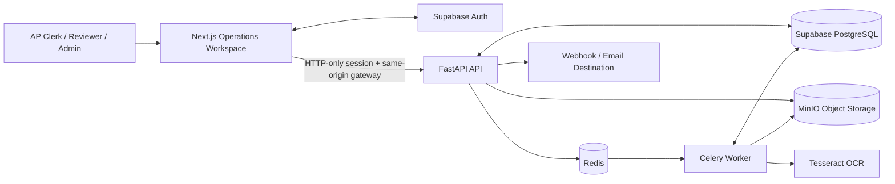

# DocuFlow AP

**Accounts-payable document automation for a fictional operations environment**

DocuFlow AP is a production-style portfolio project that receives invoices, preserves source evidence, performs local OCR, extracts canonical invoice data, applies deterministic controls, detects duplicates, matches vendors and purchase orders, routes uncertain cases to human review, and delivers approved accounting exports through an authenticated operations workspace.

> This is an independent simulated-client portfolio system. All documents, vendors, users, purchase orders, screenshots, and acceptance evidence use synthetic or sanitized data.

## What the system demonstrates

- Secure PDF, JPEG, and PNG intake with bounded file reads and content-based validation
- Immutable source-document preservation in S3-compatible object storage
- SHA-256 intake idempotency and separate business-level duplicate detection
- Asynchronous preprocessing and OCR through Celery and Redis
- Local Tesseract OCR with canonical header and line-item extraction
- Confidence, source evidence, and versioned extraction records
- Deterministic header, line, currency, date, and amount validation
- Vendor identity and purchase-order header/line matching
- An authoritative `AUTO_APPROVED`, `REVIEW_REQUIRED`, or `REJECTED` decision policy
- Supabase authentication with database-authoritative AP clerk, reviewer, and administrator roles
- Refreshable HTTP-only browser sessions and a same-origin Next.js operations gateway
- Review ownership, notes, correction overlays, control reruns, and audited resolution
- Idempotent JSON and CSV accounting exports
- HMAC-signed webhook delivery, local/SMTP email delivery, retries, and administrator requeue
- Live dashboard metrics, search, filters, sorting, pagination, and invoice audit visibility
- Repeatable unit, integration-style, frontend, and full smoke validation

## Architecture



The detailed component, trust-boundary, decision, review, export, and delivery design is documented in [`docs/architecture/system-architecture.md`](docs/architecture/system-architecture.md).

## Core flow

1. An invoice enters through web upload, email intake, or batch-import metadata.
2. The API validates the file signature, type, size, page count, source channel, and filename.
3. The source file is stored in MinIO and the intake record is persisted with a SHA-256 digest.
4. Celery preprocesses the document and runs local Tesseract OCR.
5. Canonical header fields and line items are extracted with confidence and evidence.
6. Deterministic controls validate required fields, arithmetic, currency, dates, and line totals.
7. Business duplicate, vendor identity, and purchase-order controls run independently.
8. The versioned decision engine returns `AUTO_APPROVED`, `REVIEW_REQUIRED`, or `REJECTED`.
9. Reviewers can claim uncertain cases, record notes, apply correction overlays, rerun controls, and resolve the case without mutating original OCR evidence.
10. Approved invoices produce idempotent JSON or CSV exports and retry-safe webhook or email deliveries.
11. Operators inspect every processing, review, export, delivery, and audit event through the dashboard.

## Technical stack

- **Frontend:** Next.js 16, React 19, TypeScript
- **Backend:** FastAPI, Python 3.12, SQLAlchemy
- **Database/Auth:** Supabase PostgreSQL and Supabase Auth
- **Object storage:** MinIO with an S3-compatible interface
- **Background processing:** Celery and Redis
- **Document processing:** Tesseract, OpenCV, Pillow, PyMuPDF, PyPDF
- **Delivery:** Signed webhooks, local email sink, SMTP adapter
- **Infrastructure:** Docker Compose and local Supabase CLI
- **Testing:** Pytest and executable acceptance/smoke scripts

## Reliability and safety decisions

- Uploads are read with a configured upper bound before processing.
- File types are detected from content rather than trusted from the browser declaration.
- Exact file retries reuse the existing document instead of repeating downstream work.
- Original source files, OCR results, extraction evidence, and automated decisions remain separate from human corrections.
- Deterministic controls—not OCR confidence alone—authorize straight-through approval.
- Any approval condition that cannot be proven becomes `REVIEW_REQUIRED`.
- Confirmed business duplicates are rejected consistently.
- Application roles are loaded from PostgreSQL rather than trusted from arbitrary JWT claims.
- Supabase sessions use HTTP-only, same-site cookies; production cookies require HTTPS.
- Review approval requires current controls for the current correction version.
- Accounting exports use deterministic identities and preserve payload digests.
- CSV cells that could be interpreted as spreadsheet formulas are escaped.
- Webhooks use stable delivery identifiers, HMAC signatures, a host allowlist, and capped retries.
- Every sensitive action and delivery attempt remains attributable and auditable.
- No processing failure is converted into a false business rejection.

## Run locally

The complete Windows/Docker setup is documented in [`docs/setup/local-development.md`](docs/setup/local-development.md).

After configuration, the main local endpoints are:

- Operations workspace: `http://127.0.0.1:31000`
- FastAPI documentation: `http://127.0.0.1:8000/docs`
- API readiness: `http://127.0.0.1:8000/health/ready`
- MinIO console: `http://127.0.0.1:9002`
- Supabase Studio: `http://127.0.0.1:54323`

Run the complete acceptance suite with:

```powershell
powershell -ExecutionPolicy Bypass `
    -File scripts\smoke_test.ps1
```

## Validation status

The completed local build passed the full DocuFlow AP acceptance workflow, including service readiness, Tesseract availability, automated tests, secure intake, OCR, header and line extraction, deterministic validation, duplicate detection, vendor and purchase-order matching, authoritative decisions, authentication and role enforcement, review corrections and resolution, accounting exports, notification retry behavior, dashboard APIs, browser authentication, and the interactive operations workspace.

The release-documentation contract can be checked independently with:

```powershell
docker compose exec -T api `
    python -m scripts.check_release_documentation
```

## Evidence

Portfolio evidence is organized under [`evidence/`](evidence/README.md). The capture plan covers:

- authenticated and demo-role login
- operations overview
- searchable and sortable invoice queue
- extracted header and line evidence
- deterministic control outcomes
- human review ownership and corrections
- accounting export generation and download
- webhook/email delivery attempts and retry recovery
- complete smoke-test output
- repository and secret-hygiene proof

The exact filenames, capture order, redaction rules, and demo-video sequence are defined in [`docs/release/portfolio-evidence-plan.md`](docs/release/portfolio-evidence-plan.md).

## What this portfolio project proves

- I can design a multi-service document-automation system with explicit trust boundaries.
- I can translate accounts-payable policy into deterministic, versioned controls.
- I can use OCR as evidence input without allowing probabilistic output to become the source of truth.
- I can preserve original machine evidence while supporting attributable human corrections.
- I can build retry-safe exports, signed downstream delivery, and operator recovery workflows.
- I can secure an internal operations product with real authentication, role enforcement, and auditable actions.
- I can validate the complete system through repeatable Docker setup and executable acceptance tests.

## Important limitation

This repository is a portfolio implementation, not a deployed accounting production system. It does not post transactions into a live ERP, execute payments, or process real financial records. A production deployment would still require organization-specific approval policy, tax and currency rules, ERP mappings, malware scanning, secrets management, HTTPS, monitoring, backups, retention enforcement, disaster recovery, provider capacity planning, privacy review, and named operational ownership.
