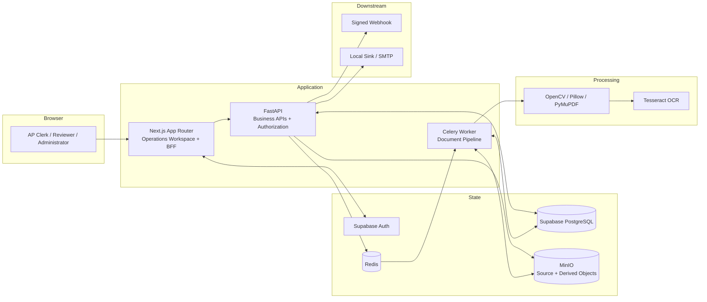
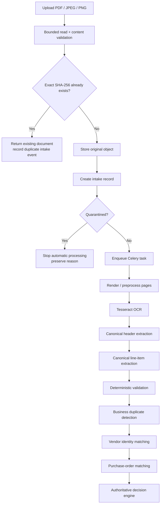
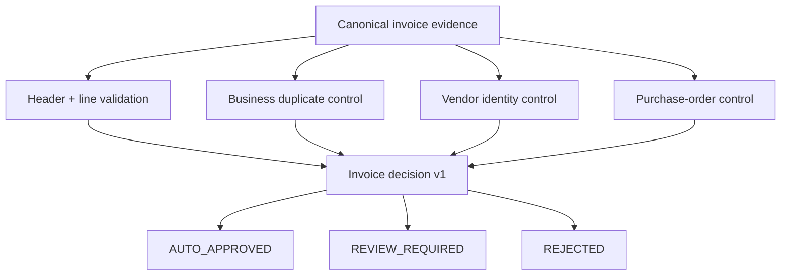
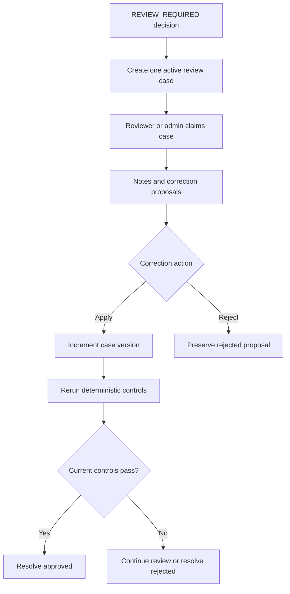
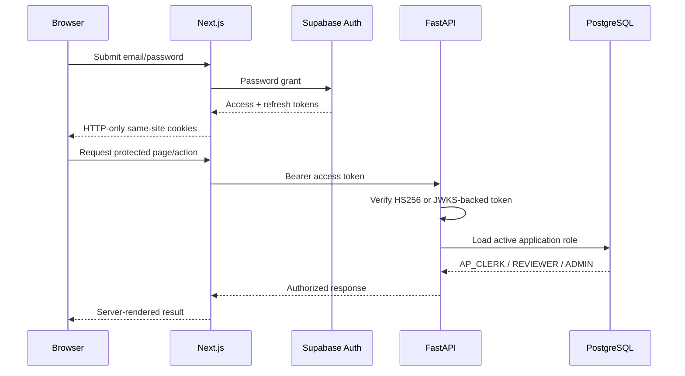
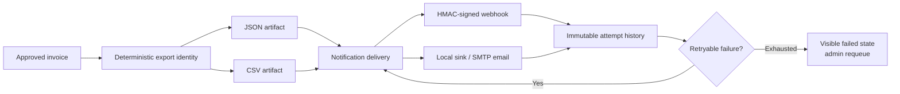

# DocuFlow AP System Architecture

> Portfolio implementation for a fictional accounts-payable environment. All example invoices, identities, purchase orders, and operational evidence are synthetic or sanitized.

## 1. Purpose

DocuFlow AP converts incoming invoice documents into controlled accounting-ready records.

The architecture is designed around five principles:

1. preserve the original document and machine evidence;
2. keep deterministic business controls authoritative;
3. isolate long-running document work from HTTP requests;
4. route uncertainty to accountable human review;
5. make exports, deliveries, failures, and overrides replay-safe and auditable.

## 2. High-level architecture

## 3. Responsibility boundaries

### Next.js

Next.js provides the authenticated operator experience and acts as a backend-for-frontend boundary.

Responsibilities:

- email/password sign-in through Supabase Auth;
- optional local portfolio demo-role sessions;
- HTTP-only access and refresh cookies;
- protected routes and session refresh;
- same-origin forwarding of allowlisted operations requests;
- server-rendered dashboard, queue, and detail data;
- interactive review, export, and delivery controls.

Next.js does not own financial decision policy or application-role authority.

### FastAPI

FastAPI owns the business contracts.

Responsibilities:

- upload validation and canonical intake;
- authentication and database-authoritative role authorization;
- evidence and dashboard APIs;
- deterministic validation policy;
- duplicate, vendor, and purchase-order controls;
- authoritative decision policy;
- review ownership and correction policy;
- export rendering and idempotency;
- notification creation, signing, retry, and administrator recovery;
- audit-event creation.

### Celery and Redis

Celery isolates document processing from the upload request. Redis is the broker and result backend.

Responsibilities:

- asynchronous document-pipeline execution;
- retryable OCR and processing tasks;
- worker isolation from the HTTP process;
- deterministic worker health checks in the smoke suite.

### Supabase PostgreSQL

PostgreSQL is the operational source of truth.

It stores:

- intake and source metadata;
- processing, page, and OCR runs;
- extracted header and line evidence;
- validation results;
- duplicate candidates;
- vendor and purchase-order matches;
- authoritative decisions;
- application roles and security events;
- review cases, notes, corrections, control reruns, and resolutions;
- accounting exports and events;
- notification deliveries and immutable attempt evidence.

### MinIO

MinIO provides S3-compatible object storage for:

- original source invoices;
- derived page images;
- generated artifacts where configured.

Original evidence is stored separately from database summaries and correction overlays.

### Supabase Auth

Supabase Auth establishes user identity. FastAPI verifies the issued JWT and loads the authoritative DocuFlow role from `app_user_roles`.

Supported application roles:

- `AP_CLERK`
- `REVIEWER`
- `ADMIN`

## 4. Document-processing flow

## 5. Evidence model

DocuFlow separates four evidence layers:

1. **Source evidence** — the original file, digest, media type, page count, source channel, and object key.
2. **Machine evidence** — preprocessing runs, OCR output, token confidence, extraction runs, fields, line items, and rule results.
3. **Decision evidence** — policy version, threshold snapshot, upstream references, outcome, reason codes, and reviewer-readable explanation.
4. **Human evidence** — case ownership, notes, correction overlays, control reruns, resolution actor, resolution note, and timestamps.

Human corrections do not rewrite the original OCR or extraction records.

## 6. Deterministic control model

`AUTO_APPROVED` requires every configured approval condition to be proven.

A confirmed business duplicate produces `REJECTED`.

A technical failure remains a processing failure. It is not converted into a business rejection.

Any unresolved, missing, stale, or uncertain approval condition produces `REVIEW_REQUIRED`.

## 7. Human review and correction flow

Important safeguards:

- `AP_CLERK` can propose corrections.
- Only the claiming reviewer or an administrator can apply or reject them.
- Applying a correction increments the case version.
- Approval requires a successful control run for the current case version.
- A confirmed duplicate cannot be manually approved.
- Original automated-decision evidence remains unchanged.

## 8. Authentication and browser trust boundary

The frontend proxy is an early route guard. FastAPI remains the authorization authority.

## 9. Export and delivery flow

Export identity includes schema version, document, format, source kind, and source version.

Notification identity includes template version, export, channel, and normalized destination hash.

Repeated equivalent requests reuse the same business identity.

## 10. Local deployment topology

Docker Compose runs:

- `api`
- `worker`
- `redis`
- `minio`
- `minio-init`
- `frontend`

Local Supabase runs separately through the Supabase CLI and provides PostgreSQL, Auth, REST services, and Studio.

The optional `frontend-production` Compose profile builds the standalone Next.js production image.

## 11. Production hardening still required

The portfolio architecture intentionally stops before organization-specific production deployment.

A real deployment must add or finalize:

- HTTPS and secure-cookie enforcement;
- managed secrets and key rotation;
- malware scanning and document-content threat controls;
- organization-specific approval, tax, currency, and tolerance policy;
- ERP/vendor-master integration and reconciliation;
- backup, restore, retention, and legal-hold procedures;
- centralized logs, metrics, alerting, and tracing;
- rate limits, capacity planning, and queue-depth alarms;
- privacy, financial-control, and access-review procedures;
- disaster-recovery targets and named operational ownership.
